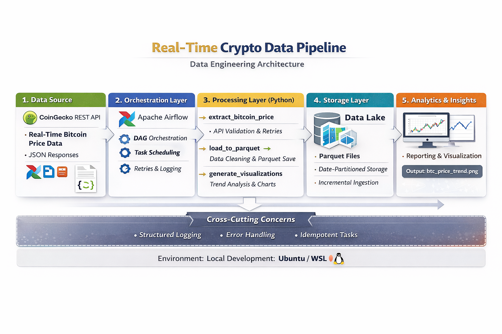

# 🚀 Real-Time Crypto Data Pipeline

A **production-style data engineering pipeline** that fetches real-time Bitcoin price data using the CoinGecko API, processes it with Apache Airflow, stores it in structured format, and generates analytical insights and visualizations.

---

## 📌 Project Overview

This project demonstrates how to design and implement a **real-time data pipeline** using modern data engineering tools and best practices such as orchestration, idempotent tasks, structured logging, and fault tolerance.

## 🏗️ Architecture

**Flow:**

CoinGecko API  
→ Apache Airflow (Orchestration)  
→ Python Processing Tasks  
→ Parquet / CSV Storage  
→ Analytics & Visualization  

**Key Layers:**
- Data Source
- Orchestration Layer
- Processing Layer
- Storage Layer
- Analytics & Insights

## 📐 Architecture Diagram




---

## 🧩 Tech Stack

- **Language:** Python  
- **Orchestration:** Apache Airflow  
- **Data Source:** CoinGecko REST API  
- **Storage:** CSV / Parquet  
- **Visualization:** Matplotlib  
- **Environment:** Ubuntu / WSL  

---

## ⚙️ Pipeline Tasks

### 1. `extract_bitcoin_price`
- Fetches real-time BTC price data
- Handles API rate limits & retries
- Validates JSON responses

### 2. `load_to_parquet`
- Cleans and normalizes data
- Enforces schema
- Stores data incrementally

### 3. `generate_visualizations`
- Performs trend analysis
- Generates price charts
- Outputs `btc_trend.png`

---

## 📁 Project Structure

```text
Real-Time-Crypto-Data-Pipeline/
│
├── dags/                    # Airflow DAG definitions
├── analyze_btc.py           # Data analysis & visualization
├── bitcoin_prices.csv       # Stored BTC price data
├── btc_trend.png            # Generated trend visualization
├── webserver_config.py      # Airflow webserver configuration
├── .gitignore
└── README.md
